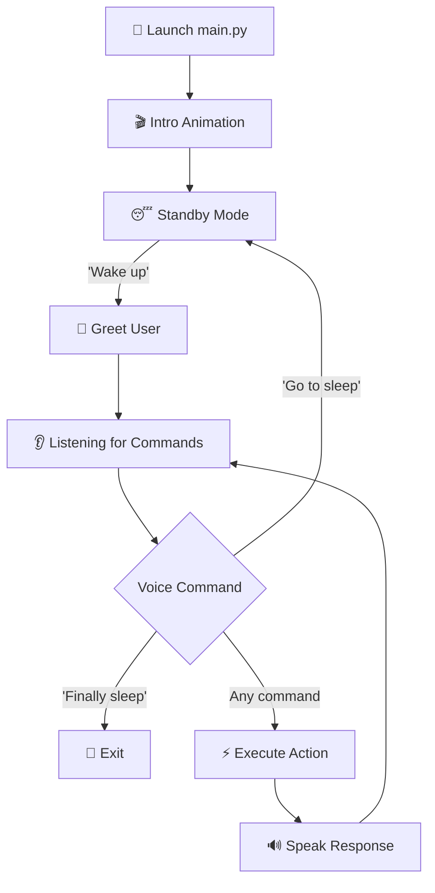

<div align="center">

# 🎙️ VoiceAI — Intelligent Voice Assistant

**A powerful, modular voice-controlled desktop assistant built with Python**

[](https://www.python.org/)
[](https://www.microsoft.com/windows)
[](LICENSE)

<br/>

*Control your computer, search the web, get the news, set alarms, send messages — all with your voice.*

---

</div>

## 📖 Table of Contents

- [Overview](#-overview)
- [Features](#-features)
- [Tech Stack](#-tech-stack)
- [Project Structure](#-project-structure)
- [Prerequisites](#-prerequisites)
- [Installation](#-installation)
- [Usage](#-usage)
- [Voice Commands Reference](#-voice-commands-reference)
- [API Keys & Environment Setup](#-api-keys--environment-setup)
- [Contributing](#-contributing)
- [Known Limitations](#-known-limitations)
- [License](#-license)

---

## 🧠 Overview

**VoiceAI** is a desktop voice assistant for Windows that listens to your spoken commands and performs a wide variety of tasks — from opening applications and searching the web, to reading the latest news, translating text, checking live cricket scores, and much more.

The assistant uses **Google Speech Recognition** for converting speech to text and **pyttsx3** (Microsoft SAPI5) for text-to-speech output, creating a seamless conversational experience. On startup, VoiceAI plays an animated GIF intro with sound to greet the user before entering the always-listening command loop.

---

## ✨ Features

| Category | Feature | Description |
|---|---|---|
| 🗣️ **Voice Control** | Speech Recognition | Continuous listening with Google Speech-to-Text |
| 🔊 **Voice Output** | Text-to-Speech | Natural voice responses via Microsoft SAPI5 engine |
| 🎬 **Intro Animation** | Startup GIF + Sound | Animated splash screen with background music on launch |
| 🌐 **Web Search** | Google / YouTube / Wikipedia | Search and hear summarized results by voice |
| 📰 **News Reader** | Latest Headlines | Fetches and reads news from 6 categories via NewsAPI |
| 🧮 **Calculator** | Wolfram Alpha | Solve complex math and science queries by voice |
| 🌍 **Translator** | Multi-Language Translation | Translate text between languages with TTS playback |
| 📱 **WhatsApp** | Send Messages | Schedule and send WhatsApp messages via PyWhatKit |
| 🖥️ **App Control** | Open / Close Apps | Launch or kill desktop applications and websites |
| 🔊 **Media Control** | Play / Pause / Mute / Volume | Control media playback and system volume |
| 📸 **Screenshot** | Capture Screen | Take and save screenshots instantly |
| 📷 **Camera** | Click Photo | Open the camera app and capture a photo |
| ⏰ **Alarm** | Set Alarms | Set timed alarms with audio notification |
| 📋 **Task Scheduler** | Daily Schedule | Create, save, and review your daily task list |
| 🌡️ **Weather** | Temperature & Weather | Get live temperature and weather for your city |
| 🏏 **Live Scores** | IPL Cricket Score | Fetch and display live IPL scores from Cricbuzz |
| 🚀 **Speed Test** | Internet Speed | Measure upload and download speeds |
| 🧠 **Memory** | Remember Things | Tell the assistant to remember and recall notes |
| 🎯 **Focus Mode** | Block Distractions | Block social media sites to help you focus |
| ⚡ **System Control** | Shutdown PC | Safely shut down your computer by voice |

---

## 🛠️ Tech Stack

| Technology | Purpose |
|---|---|
| **Python 3.10+** | Core programming language |
| **pyttsx3** | Offline text-to-speech (SAPI5) |
| **SpeechRecognition** | Google Speech-to-Text API |
| **PyAudio** | Microphone audio capture |
| **PyAutoGUI** | GUI automation & keyboard control |
| **Pygame** | Audio playback and mixer |
| **Requests + BeautifulSoup4** | Web scraping (weather, scores) |
| **Wolfram Alpha API** | Computational math engine |
| **NewsAPI** | Real-time news headlines |
| **PyWhatKit** | YouTube search & WhatsApp messaging |
| **Wikipedia** | Wikipedia article summaries |
| **Translate** | Language translation |
| **Plyer** | Desktop notifications |
| **Speedtest-cli** | Internet speed measurement |
| **pynput** | System volume control |
| **Tkinter + Pillow** | Intro GIF animation window |
| **python-dotenv** | Environment variable management |

---

## 📁 Project Structure

```
VoiceAI/
│
├── main.py              # 🚀 Entry point — main command loop & all voice handlers
├── INTRO.py             # 🎬 Startup GIF animation with sound
├── GreetMe.py           # 👋 Time-based greeting (Morning/Afternoon/Evening)
├── Dictapp.py           # 🖥️ Open/close applications and websites
├── SearchNow.py         # 🔍 Google, YouTube, and Wikipedia search
├── NewsRead.py          # 📰 Fetch and read news headlines (NewsAPI)
├── Calculate.py         # 🧮 Wolfram Alpha calculator
├── TranslateWord.py     # 🌍 Text translation (translate library)
├── Translator.py        # 🌍 Advanced translation with Google TTS
├── Whatsapp.py          # 📱 Send WhatsApp messages via PyWhatKit
├── keyboard.py          # 🔊 System volume up/down control
├── alarm.py             # ⏰ Alarm clock with audio ring
├── FocusMode.py         # 🎯 Block distracting websites (admin mode)
├── Installer.py         # 📦 Quick dependency installer
│
├── .env                 # 🔐 API keys & secrets (git-ignored)
├── .env.example         # 📄 Template for environment variables
├── .gitignore           # 🚫 Files excluded from version control
├── .gitattributes       # 🏷️ Git language detection config
│
├── Alarmtext.txt        # Temp file for alarm time storage
├── tasks.txt            # Saved daily tasks/schedule
├── Remember.txt         # Notes the assistant remembers
├── focus.txt            # Focus mode session log
├── PyWhatKit_DB.txt     # PyWhatKit internal log
│
├── Startup2.mp3         # 🎵 Intro startup sound
├── music.mp3            # 🎵 Alarm ringtone
├── notification.mp3     # 🔔 Notification sound effect
├── speakintro.gif       # 🎬 Startup animation GIF
├── ironsnap2.gif        # 🎬 Additional animation asset
└── ss.jpg               # 📸 Last saved screenshot
```

---

## 📋 Prerequisites

- **Operating System:** Windows 10 / 11
- **Python:** 3.10 or higher
- **Microphone:** A working microphone connected to your PC
- **Internet:** Required for speech recognition, web search, news, and APIs

---

## 🚀 Installation

### 1. Clone the Repository

```bash
git clone https://github.com/HardikRaut26/Voice-Assistant.git
cd Voice-Assistant
```

### 2. Install Dependencies

```bash
pip install pyttsx3 SpeechRecognition pyaudio requests beautifulsoup4 pyautogui plyer pygame speedtest-cli translate pywhatkit wolframalpha pyperclip pynput wikipedia googletrans==4.0.0-rc1 gTTS playsound Pillow python-dotenv
```

> **Note:** If `pip install pyaudio` fails on Windows, download the appropriate `.whl` file from [Unofficial Windows Binaries](https://www.lfd.uci.edu/~gohlke/pythonlibs/#pyaudio) and install it manually:
> ```bash
> pip install PyAudio‑0.2.14‑cp312‑cp312‑win_amd64.whl
> ```

### 3. Set Up Environment Variables

```bash
cp .env.example .env
```

Open the `.env` file and add your API keys (see [API Keys & Environment Setup](#-api-keys--environment-setup) below).

### 4. Run the Assistant

```bash
python main.py
```

### Alternative: Run the Pre-built Executable

If you don't want to set up Python, simply double-click `main.exe` to launch VoiceAI directly.

---

## 🎮 Usage

1. **Launch** the assistant by running `python main.py`.
2. The **intro animation** will play with a startup sound.
3. The assistant enters **standby mode** — say **"Wake up"** to activate it.
4. Give voice commands (see the reference table below).
5. Say **"Go to sleep"** to return to standby mode.
6. Say **"Finally sleep"** to exit the program completely.

### Workflow Diagram



---

## 🗂️ Voice Commands Reference

### 🔧 System & Apps

| Command | Action |
|---|---|
| `"Wake up"` | Activate the assistant from standby |
| `"Go to sleep"` | Return to standby mode |
| `"Finally sleep"` | Exit the program |
| `"Open [app name]"` | Open an application (chrome, vscode, word, excel, paint, etc.) |
| `"Open [website.com]"` | Open a website in the browser |
| `"Close [app name]"` | Close / kill an application |
| `"Close [N] tab"` | Close N browser tabs (1–5) |
| `"Shutdown system"` | Shut down the computer |

### 🔍 Search & Information

| Command | Action |
|---|---|
| `"Google [query]"` | Search Google and hear a summary |
| `"YouTube [query]"` | Search and play a YouTube video |
| `"Wikipedia [topic]"` | Hear a Wikipedia summary |
| `"News"` | Listen to latest headlines by category |
| `"Temperature"` | Get current temperature in Mumbai |
| `"Weather"` | Get current weather in Mumbai |
| `"IPL score"` | Get live IPL cricket scores |

### 🧮 Utilities

| Command | Action |
|---|---|
| `"Calculate [expression]"` | Solve math (e.g., "calculate 5 plus 3") |
| `"Translate"` | Translate text to another language |
| `"Internet speed"` | Run an internet speed test |
| `"The time"` | Get the current time |
| `"Screenshot"` | Capture and save a screenshot |
| `"Click my photo"` | Open camera and take a photo |
| `"Set an alarm"` | Set a timed alarm |

### 📋 Productivity

| Command | Action |
|---|---|
| `"Schedule my day"` | Create a daily task list |
| `"Show my schedule"` | View saved tasks as a notification |
| `"Remember that [note]"` | Save a note for later recall |
| `"What do you remember"` | Recall saved notes |
| `"WhatsApp"` | Send a WhatsApp message |

### 🎵 Media Control

| Command | Action |
|---|---|
| `"Play"` | Resume video playback |
| `"Pause"` | Pause video playback |
| `"Mute"` | Mute video |
| `"Volume up"` | Increase system volume |
| `"Volume down"` | Decrease system volume |
| `"Tired"` | Play a random favourite song |

### 💬 Conversation

| Command | Action |
|---|---|
| `"Hello"` | The assistant greets you |
| `"How are you"` | The assistant responds |
| `"I am fine"` | The assistant acknowledges |
| `"Thank you"` | The assistant says you're welcome |

---

## 🔑 API Keys & Environment Setup

All sensitive data (API keys, phone numbers) are stored in a `.env` file that is **excluded from Git** via `.gitignore`.

### 1. Create your `.env` file

```bash
cp .env.example .env
```

### 2. Fill in your API keys

Open `.env` and replace the placeholder values with your own:

```env
# NewsAPI Key — Get yours at https://newsapi.org/
NEWS_API_KEY=your_newsapi_key_here

# Wolfram Alpha App ID — Get yours at https://products.wolframalpha.com/api/
WOLFRAM_ALPHA_APP_ID=your_wolfram_alpha_app_id_here

# WhatsApp Contact Number (with country code)
WHATSAPP_CONTACT_1=+91XXXXXXXXXX
```

### API Key Providers

| Variable | Feature | Provider | Sign Up |
|---|---|---|---|
| `NEWS_API_KEY` | News Headlines | NewsAPI | [newsapi.org](https://newsapi.org/) |
| `WOLFRAM_ALPHA_APP_ID` | Calculator | Wolfram Alpha | [products.wolframalpha.com](https://products.wolframalpha.com/api/) |
| `WHATSAPP_CONTACT_1` | WhatsApp Messages | — | Your contact's phone number |

> **Important:** You **must** register for free API keys to use the News and Calculator features. The `.env` file is **never pushed to GitHub** — your secrets stay safe.

> **⚠️ Caution:** If you previously committed code with hardcoded API keys, consider rotating (regenerating) those keys on the respective platforms, as they may have been exposed in your Git history.

---

## 🤝 Contributing

Contributions are welcome! Here's how you can help:

1. **Fork** the repository
2. **Create** a feature branch (`git checkout -b feature/amazing-feature`)
3. **Commit** your changes (`git commit -m 'Add amazing feature'`)
4. **Push** to the branch (`git push origin feature/amazing-feature`)
5. **Open** a Pull Request

### Ideas for Contribution

- 🌐 Add support for more languages in speech recognition
- 📍 Dynamic city selection for weather/temperature
- 🤖 Integrate OpenAI/Gemini for intelligent conversations
- 📊 Add a GUI dashboard
- 🐧 Add cross-platform (Linux/macOS) support

---

## ⚠️ Known Limitations

- **Windows Only** — Uses SAPI5 and Windows-specific commands (`os.startfile`, hosts file path, etc.)
- **Requires Internet** — Speech recognition and most features need an active connection
- **Microphone Sensitivity** — Ambient noise may affect recognition accuracy; adjust `energy_threshold` in `main.py` if needed
- **Focus Mode** — Requires administrator privileges to modify the system hosts file

---

## 📄 License

This project is open-source and available under the [MIT License](LICENSE).

---

<div align="center">

**Made with ❤️ by [Hardik Raut](https://github.com/HardikRaut26)**

⭐ *Star this repo if you found it useful!* ⭐

</div>
